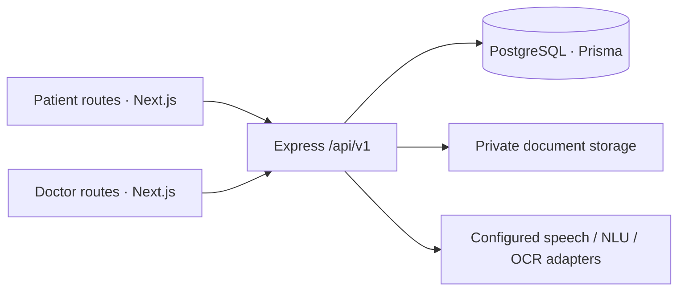

# HELIOS

**Healthcare Enabled Language & Intelligent Observation System** — “Turn patient waiting time into clinical intelligence.”

HELIOS is a Smart India Hackathon prototype. A patient uses the web app to give consent, describe a concern, optionally confirm a speech transcript or upload a document, answer follow-up questions, and receive a waiting token. A clinician uses a separate doctor workspace to review source-labelled history, documents, a timeline, changes between visits, and a clinical brief; the doctor controls verification and queue actions. Both web route trees use one Express API and PostgreSQL database. Neither browser connects to the database or to the other browser directly.

HELIOS **organizes information; it does not diagnose, prescribe, recommend treatment, or replace a clinician**. The planned Phase 5 SafetyEngine is not implemented. The visible queue priority is not a clinical safety alert. Use synthetic data only: production clinician identity, regulatory assessment, retention, backups, and deployed security assurance are incomplete.

## Status

| Area                                                                           | Current status                                                                                                |
| ------------------------------------------------------------------------------ | ------------------------------------------------------------------------------------------------------------- |
| Patient intake, interview, English/Hindi text UI, token/waiting                | Implemented in prototype scope                                                                                |
| Browser recording and speech transcription                                     | Implemented interface; default provider is deterministic mock, optional OpenAI adapter requires configuration |
| Document upload/extraction                                                     | Implemented; default mock OCR, optional local PDF text/Tesseract image path has limitations                   |
| Timeline, What Changed, Clinical Brief, AYUSH capture, doctor verification     | Implemented, with source and uncertainty handling; not clinical validation                                    |
| Separate doctor workspace, notes, queue controls, synthetic SIH demo and reset | Implemented for demo; doctor access-code login is not production identity                                     |
| Deterministic clinical SafetyEngine and full production deployment             | Not implemented                                                                                               |

See [documentation index](docs/README.md), [limitations](docs/limitations.md), and [judge summary](docs/SIH_README.md).

## Architecture



Patient and doctor views are separate route trees within the same `apps/web` deployment, **not separate deployed frontend applications**. Access to doctor data is enforced by signed session checks, active role checks, and resource authorization in API services; hiding UI alone is not the boundary. Waiting and queue screens poll backend state; there is no WebSocket/SSE service. See [architecture](docs/architecture.md) and [security](docs/security.md).

## Quick start (local development)

Prerequisites: Node.js 20.12+, pnpm 11, PostgreSQL, and a **pre-provisioned** non-superuser role/database. On PowerShell, use `Copy-Item .env.example .env`; on a POSIX shell, use `cp .env.example .env`. Edit the ignored `.env` with your own local database URL and secrets; the template does not create a role or database.

```powershell
pnpm install
pnpm db:generate
pnpm db:migrate
pnpm db:check
pnpm dev
```

Open [patient app](http://localhost:3000/patient), [doctor login](http://localhost:3000/doctor/login), and [API health](http://localhost:5000/api/v1/health). The normal `helios` database is not automatically seeded. `pnpm dev` loads root `.env` through the local wrapper; it starts both web (port 3000) and API (port 5000). The demo doctor login is for synthetic local data only.

### Isolated SIH demo

Use a separate local `helios_sih_demo` database and the [demo profile](.env.sih-demo.example). Replace placeholders in the ignored `.env`. The demo wrapper forces explicit demo flags, private storage and the dedicated demo database name. Do not point demo commands at real records.

```powershell
pnpm demo:migrate
pnpm demo:reset
pnpm demo:verify
pnpm demo:dev
```

Open [SIH demo](http://localhost:3000/sih-demo), then sign in as the seeded demo doctor using the access code set in your private `.env` to reach the [presenter guide](http://localhost:3000/doctor/sih-demo). Its **Reset Demo** button is confirmation-protected and backend-guarded; `pnpm demo:reset` is the CLI recovery path. `READY` means the supported synthetic baseline passed validation, **not** that the missing SafetyEngine or full SIH acceptance gate is complete. See [demo mode](docs/demo-mode.md) and [demo reset](docs/phase21-demo-reset.md).

## Checks

```powershell
pnpm typecheck
pnpm lint
pnpm test
pnpm build
```

`pnpm test:e2e:connected` runs the local synthetic browser suite and performs a demo reset; use it only with the guarded demo profile. Isolated database integration tests require `TEST_DATABASE_URL` naming a local `helios_test` database. See [testing](docs/testing.md) for scope and measured results. Do not read passing prototype tests as a regulatory, clinical, or penetration-test certification.

## Repository

| Path              | Role                                                           |
| ----------------- | -------------------------------------------------------------- |
| `apps/web`        | Next.js patient and doctor routes, client services/providers   |
| `apps/api`        | Express routes/controllers, services, Prisma schema/migrations |
| `packages/shared` | Shared DTOs, language registry, contracts                      |
| `dataset`         | Synthetic evaluation and document fixtures                     |
| `scripts`         | Local/demo environment wrappers and data tooling               |
| `docs`            | Current guides plus detailed phase-specific references         |

For configuration, deployment boundaries, and contributor guidance see [environment](docs/development.md), [deployment](docs/deployment.md), and [contributing](CONTRIBUTING.md).
