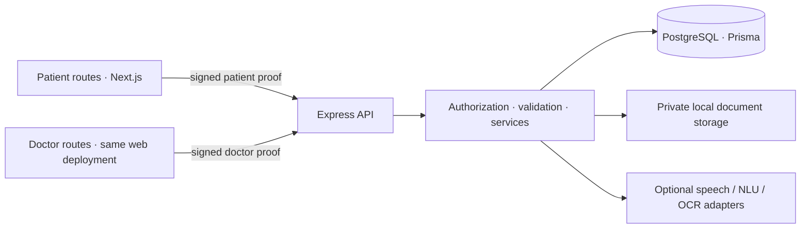
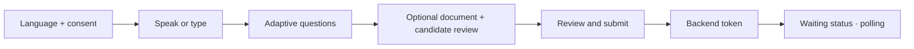
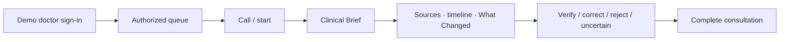
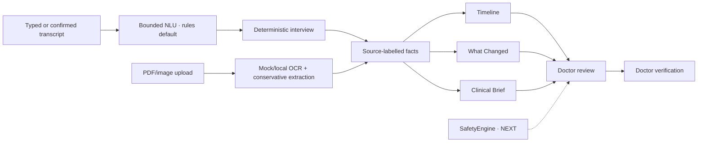
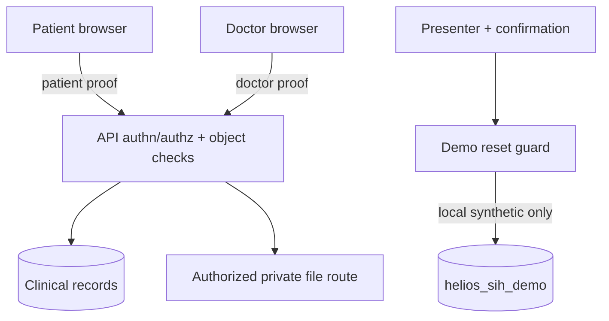
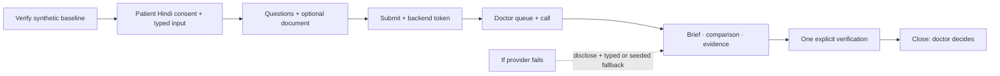

# HELIOS — presentation diagrams

Solid arrows show current data flow. Text marked **NEXT** is not implemented. These are product/implementation diagrams, not clinical decision pathways.

## 1. Product architecture

## 2. Patient flow

## 3. Doctor flow

## 4. Processing pipeline

## 5. Security boundary

## 6. Honest demo flow

