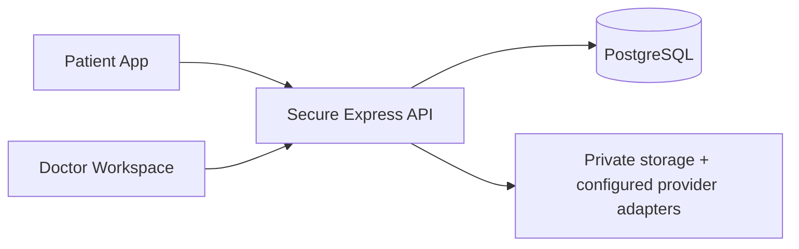

# HELIOS — SIH judge brief

**Turn patient waiting time into clinical intelligence.**

## Problem and solution

Patients often repeat fragmented histories while doctors have limited review time. HELIOS uses the waiting period for consented pre-consultation intake: the patient speaks or types, answers adaptive questions, optionally reviews extracted document facts, and receives a real queue token. The doctor gets a separate authorized workspace with source-labelled history, timeline, changes between visits, a short Clinical Brief, document evidence and explicit verification controls.

## Core innovation and boundary

HELIOS preserves **who/what supplied each fact** and separates original, structured, document-extracted and doctor-verified states. Deterministic engines control question sequencing, comparisons, brief relevance and queue transitions; optional speech/NLU/OCR adapters cannot acquire clinical or authorization authority. HELIOS organizes information—it does not diagnose, prescribe, recommend treatment, or replace a doctor. The planned clinical SafetyEngine is not implemented and must not be claimed.

Stack: Next.js/React/Tailwind, Express/Zod/Pino, PostgreSQL/Prisma, strict TypeScript/pnpm, Vitest/Testing Library/Supertest/Playwright. Queue updates use polling, not WebSockets.

## Demo

Run the isolated synthetic profile: `pnpm demo:migrate`, `pnpm demo:reset`, `pnpm demo:verify`, `pnpm demo:dev`; open `http://localhost:3000/sih-demo`. The fictional golden patient is Aarav Sharma; initial queue token is A-001. Use the private demo doctor code from `.env`, never show it. Presenter instructions: [three-minute script](SIH_DEMO_SCRIPT.md), [pitch](SIH_PITCH.md), [limitations](limitations.md).

Why it matters: less repeated collection, clearer provenance, faster navigation of longitudinal information, and explicit human verification—without pretending automation is a clinician.
