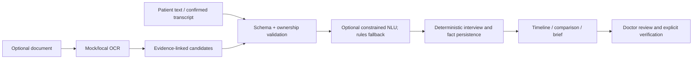

# AI and deterministic processing

HELIOS does not have one autonomous “AI doctor.” The backend composes optional, bounded provider adapters with deterministic domain logic. Speech, NLU and OCR defaults are **mock/rules**, not live production AI. No trained HELIOS model weights or automated diagnosis exist.

| Component                                   | Current adapter/config                                                                                                  | Input → output                                                                | Failure/fallback                                                              |
| ------------------------------------------- | ----------------------------------------------------------------------------------------------------------------------- | ----------------------------------------------------------------------------- | ----------------------------------------------------------------------------- |
| Speech-to-text                              | `SPEECH_PROVIDER=mock` default; optional `openai` via `SPEECH_API_KEY`/`SPEECH_MODEL`                                   | Consented uploaded audio → transcript/metadata                                | Patient can edit or type; no acceptance until confirmation                    |
| Clinical NLU                                | `CLINICAL_NLU_PROVIDER=rules` default (no remote call); optional OpenAI structured adapter via server-only `AI_API_KEY` | Current question + answer + relevant fact → bounded structured interpretation | Zod validation, one bounded retry, then deterministic interpretation          |
| OCR                                         | `DOCUMENT_OCR_PROVIDER=mock` default; `local` uses PDF.js text extraction or Tesseract.js image OCR                     | Validated private PDF/image → page text and locations                         | Failure/review state; scanned image-only PDF is unsupported by local PDF path |
| Document understanding                      | HELIOS heuristic classifier and schema-bound extractor, not a general LLM                                               | OCR pages → conservative fact candidates, confidence, evidence                | Unknown/review required where unclear                                         |
| UI translation/normalization                | English/Hindi registry, glossary and deterministic display helpers                                                      | Original text/language → display text or normalized terms                     | Preserve original; unsupported languages rejected/not advertised as complete  |
| Interview/What Changed/Clinical Brief/queue | HELIOS-original deterministic services                                                                                  | Validated facts/snapshots → questions/deltas/brief/order                      | Unavailable or uncertain states; no provider may override authorization       |
| SafetyEngine                                | **Not implemented**                                                                                                     | No executable rule evaluation                                                 | UI must not imply absence of risk                                             |

The service validates provider output and source identity before persistence. Original and normalized values remain separate. AI/OCR output cannot sign in, change roles/assignments, issue tokens, mark a fact `DOCTOR_VERIFIED`, alter queue authority, change audit history, or access an unauthorized patient. Prompt injection in an uploaded document or answer is still possible as **content contamination**: strict schemas and evidence review reduce but do not eliminate it. No clinical accuracy or deployed provider quality has been certified. See [document provider implementation](document-ai/providers.md), [interview service](../apps/api/src/interview/clinical-nlu.ts), [voice](voice.md), and [security](security.md).
