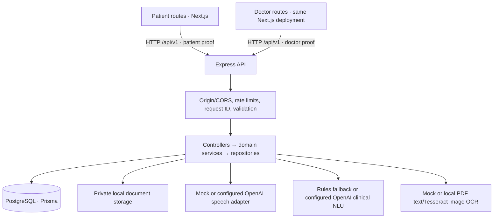
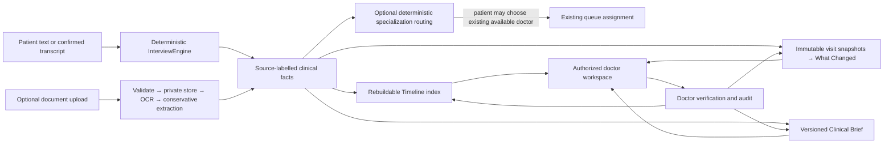
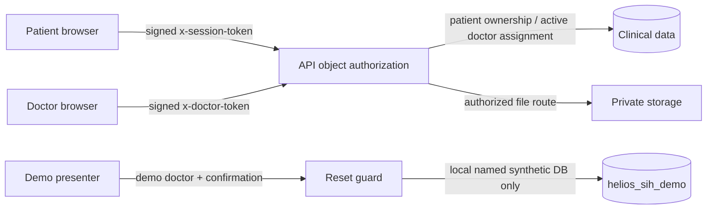

# Current system architecture

HELIOS is a pnpm/TypeScript monorepo: `apps/web` is one Next.js 15 deployment with separate `/patient` and `/doctor` route trees; `apps/api` is one Express 5 API; `packages/shared` contains DTOs/language contracts; Prisma 6 maps to PostgreSQL. Private document bytes live under a configured local storage directory. There are **not** separately deployed patient and doctor frontend applications, microservices, WebSockets, SSE, FHIR/ABDM exchange, or a production identity provider.

The patient never receives doctor-only API responses through a direct UI bridge. Patient submission persists a visit; check-in creates a token transactionally. The doctor dashboard queries authorized backend data. Doctor queue transitions update PostgreSQL; patient and doctor screens **poll** the API for updated status. Phase 21 demo reset additionally signals same-origin tabs via local storage and other browser contexts via a non-PHI reset-generation polling endpoint.

## Domain processing

Interview question sequencing, comparison, brief relevance, queue authority, and verification are deterministic service logic. Optional provider outputs are schema-validated and never acquire doctor authority. `RiskSignal` and risk-related enums exist for historical/storage projections, but **Phase 5 SafetyEngine rules are not implemented**; no live signal-generation arrow should be inferred. See [AI architecture](ai-architecture.md) and [safety](safety.md).

Specialization routing is an opt-in, database-backed intake aid that runs only on permitted patient-entered intake data. It can suggest a department and let the patient choose an existing, explicitly available doctor; queue assignment remains the existing transactional workflow. Its conservative emergency-pattern drafts are not a SafetyEngine or a clinical emergency screen. See [specialization routing](specialization-routing.md).

## Security and demo boundaries

The demo is not a separate production tenant. It uses an isolated local named database, explicit environment flags, stable synthetic IDs, and a guarded reset command. Ordinary development uses a separate `helios` database. Production handling of real patient data is not established. See [security](security.md), [database](database.md), and [demo reset](phase21-demo-reset.md).
