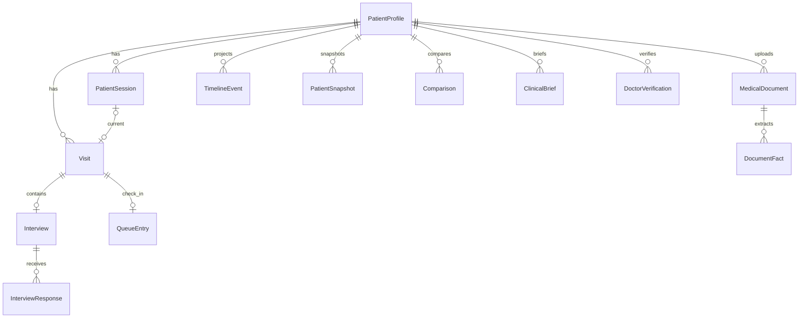

# PostgreSQL data model

The source of truth is [`apps/api/prisma/schema.prisma`](../apps/api/prisma/schema.prisma), with SQL migrations in `apps/api/prisma/migrations`. Prisma records are mapped to API DTOs; callers do not receive raw rows or storage paths. The normal local `helios` database and synthetic-only `helios_sih_demo` database are separate. There is no schema-based multitenancy, PostgreSQL row-level security, or FHIR/ABDM persistence integration.

| Models                                                                                                               | Role and important fields / relationships                                                                                                                                                       |
| -------------------------------------------------------------------------------------------------------------------- | ----------------------------------------------------------------------------------------------------------------------------------------------------------------------------------------------- |
| `User`, `DoctorPatientAssignment`                                                                                    | Role/status and doctor-to-patient scope. Demo doctor IDs are seeded; production identity is absent.                                                                                             |
| `PatientProfile`, `PatientSession`, `Visit`                                                                          | Patient code/demographics; session step/status/consent linkage; visit status, type and token. A session may link one visit.                                                                     |
| `ConsentRecord`                                                                                                      | Accepted consent type/version/time, linked to session; withdrawal field exists, but a complete revocation workflow does not.                                                                    |
| `Interview`, `InterviewResponse`, `ClinicalHistory`                                                                  | Deterministic pathway/graph state and confirmed answers; original/normalized language data, source, status, completeness.                                                                       |
| `Symptom`, `Medication`, `Allergy`, `Observation`, `AyushRecord`                                                     | Clinical/source-labelled facts, original and normalized values, temporal/verification metadata. AYUSH is neutral capture, not efficacy or interaction inference.                                |
| `VoiceInteraction`, `AIInteraction`                                                                                  | Transcript versions/provider/status and bounded operational AI metadata; raw uploaded audio is not intentionally stored.                                                                        |
| `MedicalDocument`, `DocumentPage`, `DocumentExtraction`, `DocumentFact`, `DocumentEvidence`, `DocumentProcessingJob` | Private original key/hash, OCR text/page status, extracted and normalized facts, page evidence, processing history. Deletion and storage cleanup are service operations, not just SQL cascades. |
| `TimelineEvent`, `TimelineEventVersion`                                                                              | Rebuildable chronological **projection** with source ID, temporal precision, fingerprint, conflict key and version snapshots. Primary clinical facts live in their source tables.               |
| `PatientSnapshot`, `Comparison`, `ChangeRecord`                                                                      | Immutable visit snapshot, cached comparison, field-level deltas and evidence/provenance.                                                                                                        |
| `ClinicalBrief`, `BriefClaim`                                                                                        | Versioned, source-revision keyed doctor brief and separately linked claims/evidence.                                                                                                            |
| `DoctorVerification`                                                                                                 | Immutable action, original/new values, doctor ID/time, version/idempotency key. Source facts retain verification status/version.                                                                |
| `QueueCounter`, `QueueEntry`, `QueueEvent`                                                                           | Date/key-specific next sequence and pause flag; one queue entry per visit, unique sequence within queue/date; append-only action events.                                                        |
| `DoctorNote`, `AuditLog`, `SystemConfig`                                                                             | Doctor-only notes, metadata-minimized operational audit, JSON configuration. Audit retention/immutability enforcement is incomplete.                                                            |
| `RiskSignal`                                                                                                         | Storage/read schema only. **No implemented SafetyEngine generates rule-based signals.**                                                                                                         |

`ClinicalSource` includes `PATIENT_REPORTED`, `AI_STRUCTURED`, `DOCUMENT_EXTRACTED`, `DOCTOR_ENTERED`, `AYUSH_PRACTITIONER_DOCUMENTED`, `DOCTOR_VERIFIED`, and `SYSTEM_GENERATED`. `KnowledgeState` distinguishes `YES`, `NO`, `UNKNOWN`, `NOT_ASKED`, `NOT_APPLICABLE`, and `CONFLICT`. Original speech text, OCR evidence, source IDs and original/normalized fact values are retained separately where their models support it. A model-generated or document-extracted value is **not** automatically doctor-verified. `DoctorVerification` preserves correction/action history rather than overwriting its source trail. See [verification provenance](verification/provenance.md).

Queue status is `WAITING`, `CALLED`, `IN_CONSULTATION`, `COMPLETED`, `CANCELLED`, `NO_SHOW`, or `SKIPPED`; the API enforces allowed transitions. `QueuePriority` is `NORMAL` or `PRIORITY_REVIEW`, **not** a SafetyEngine conclusion. Comparison and brief status enums are versioned independently from visit status. See [queue architecture](queue/architecture.md), [comparison semantics](comparison/04-change-semantics.md), and [brief model](clinical-brief/data-model.md).

Do not use the synthetic seed in the normal or production database. `pnpm demo:migrate`/`pnpm demo:reset` target the isolated demo database through explicit guards; [Phase 21](phase21-demo-reset.md) documents scope and its non-atomic file/SQL boundary.
