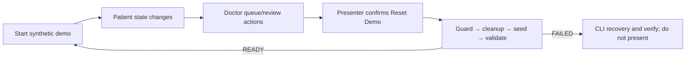

# SIH demo mode

The demo is a synthetic, local profile using `helios_sih_demo`, private demo storage, explicit server/client flags, stable seed IDs and real application routes. Start it with:

```powershell
pnpm demo:migrate
pnpm demo:reset
pnpm demo:verify
pnpm demo:dev
```

Open `/sih-demo`; the protected guide is `/doctor/sih-demo`. The golden patient is fictional Aarav Sharma (`DEMO-AARAV-024`) with two visits and initial queue token **A-001**, not A-024. `demo.doctor` signs in using the private `.env` access code. The entry/guide navigate to real patient/doctor screens; they do not bypass consent, queue state or verification.

The three-minute path is [SIH demo script](SIH_DEMO_SCRIPT.md); the five-minute path is [deep dive](sih-demo-deep-dive.md). Typed text is the honest fallback for microphone/provider failure. Preseeded synthetic evidence may be shown if a live document attempt fails, but must not be represented as the failed upload's result. If backend/database health is unavailable, stop rather than simulate success.

The presenter Reset Demo control and CLI recovery are documented in [demo reset](demo-reset.md). Demo mode is not production, and `READY` does not cover the absent SafetyEngine or a complete clinical validation.


