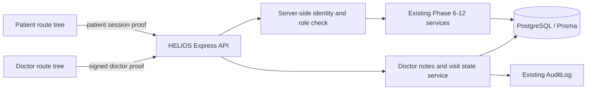

# Phase 13 doctor dashboard architecture

## Boundary

The patient and doctor experiences are separate Next.js route trees. Patient pages live under `/patient/*`; doctor pages, layout, navigation, authentication state and API client live under `/doctor/*` and doctor-named modules. Both call the same Express API and PostgreSQL database. The patient UI never imports or renders `DoctorNote`, verification history, audit data or doctor workflow controls.

The backend derives doctor identity exclusively from `x-doctor-token`, verifies its HMAC signature, and resolves an active `DOCTOR` or `ADMIN` record. New Phase 13 queue queries are filtered through active `DoctorPatientAssignment` rows; workspace, note and visit-status operations check that assignment before returning or changing data. Admins have an explicit bypass. Request bodies and query strings have no accepted `doctorId`, `userId`, or `role` fields. A patient-session proof is cryptographically different and fails doctor verification.

## Doctor modules

- `DoctorAuthProvider` keeps the demo doctor session in `sessionStorage`; it does not persist clinical payloads.
- `DoctorShell` owns doctor-only navigation and route guarding.
- `doctorDashboardApi` is the typed network boundary.
- `DoctorDashboardService` composes queue projections and reuses Clinical Brief, What Changed, verification, document and timeline services/repositories.
- `DoctorDashboardRepository` contains scoped queries and transactional writes for notes, state changes and audit records.

## Data flow

Dashboard reads are bounded to 250 assigned candidate visits, then filtered, sorted and paginated. When the current day has no rows in demo mode, the service explicitly reports `RECENT_ACTIVE_DEMO_FALLBACK`; production behavior must replace this demo convenience with a real scheduling source. Earlier Phase 8–12 doctor endpoints have their own active-doctor authorization but do not yet apply Phase 13 assignment filtering; do not deploy this demo as a multi-clinician tenant without extending those endpoints.

Opening a workspace loads one selected/latest visit, at most 20 documents, at most 75 timeline events, 50 verification-history entries and 100 notes. Clinical Brief and What Changed are reused from their deterministic backend implementations. The browser does not calculate clinical changes or create safety conclusions.

## Safety and AI boundary

This checkout has no Phase 5 SafetyEngine. Phase 13 only displays stored `RiskSignal` rows, labels them “Requires clinical review,” and declares `safetyEngineAvailable: false`. AI Insights show already-structured counts, missing information and contradictions. No diagnosis, treatment plan, prescription, autonomous emergency action or risk-free claim is generated.

## Mutations

- Notes are separate `DoctorNote` rows; patient statements remain unchanged.
- Only the note author or an admin can edit a note, and the query includes the patient identifier before mutation.
- Visit transitions follow a server-side state map; arbitrary jumps are rejected with HTTP 409.
- Note creation/edit and status change use database transactions that also create `AuditLog` rows.
- Existing Phase 10 verification endpoints remain the single verification implementation.

## Production gaps

The included sign-in is explicitly a synthetic demo credential flow. Production requires an identity provider, short-lived sessions, secure cookies or equivalent token transport, care-team/tenant patient authorization, revocation, rate limiting, CSRF controls where applicable, PHI policy review and operational audit retention. The current app makes no medical-device or regulatory-compliance claim.
