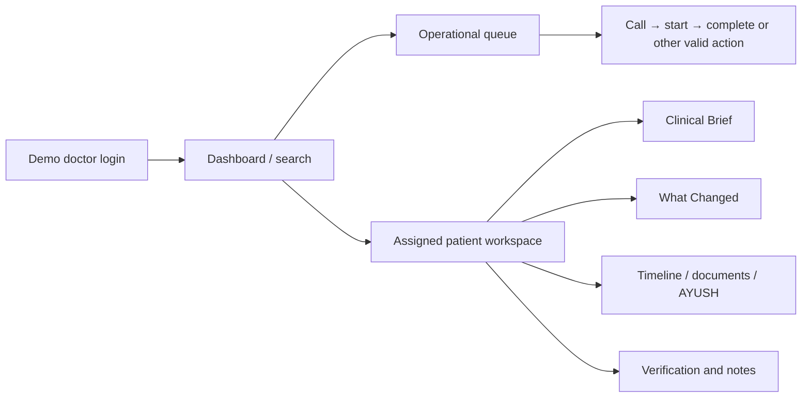

# Doctor workspace (demo-scoped identity)

The `/doctor` route tree is separate from the patient route tree but lives in the same Next.js deployment. `/doctor/login` exchanges the configured **demo access code** for a signed doctor token (`POST /api/v1/doctor-sessions`). The API checks token, active user/role and patient assignment/resource scope; the client-side route gate is convenience, not the security control. This is not production clinician authentication.

The dashboard shows authorized patient search, queue/clinic metrics and notifications. `/doctor/queue` operates real backend entries: call next, pause/resume, call/start/complete/skip/no-show/cancel/requeue according to state rules. Queue status is polled; it is not WebSocket live. A patient workspace under `/doctor/patients/:patientId` aggregates visit history, source-labelled records, documents, timeline, Clinical Brief, comparisons, verification and doctor-only notes. Separate subpages expose brief and AYUSH context; the Verification Center is `/doctor/verification` and What Changed is `/doctor/what-changed`.

The doctor may verify, correct, reject or mark source facts uncertain with immutable history. The original source and value are retained in verification records; a doctor action does not rewrite an AI/OCR output into an untraceable fact. Notes and visit transitions are backend-authorized and audited. The Clinical Brief is a time-saving review aid, not a medical decision. `RiskSignal` display surfaces stored data, but no Phase 5 SafetyEngine calculates clinical attention signals. A lack of a badge must never be interpreted as no risk.

The patient frontend does **not** expose doctor search, notes, verification actions, dashboard counts, clinic-wide queue, or `/doctor/sih-demo` controls. The browser routes alone are not an access boundary: API authorization and object checks enforce this separation. See [API](api.md), [security](security.md), and [Phase 13 architecture](doctor-dashboard/architecture.md).
