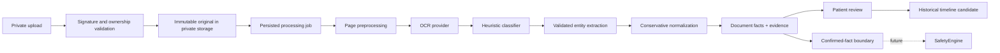

# Document AI architecture

Phase 6 adds an optional, patient-facing document workflow without replacing HELIOS's patient, visit, timeline, verification, or repository boundaries.

The original file, OCR pages, extracted values, normalized values, and reviewed/verified values are distinct. Patient confirmation produces `CONFIRMED`; only a later clinician workflow may produce `VERIFIED`/`DOCTOR_VERIFIED`.

The API follows the existing controller → service → repository structure. Local files live under `STORAGE_PATH`, never under Next.js `public` or an Express static mount. Every read and mutation requires the HMAC session token and a document/session ownership match.

## Safety boundary

Document AI does not create `RiskSignal` records and never diagnoses or interprets a measurement. `DocumentService.safetyEligibleFacts` exposes only patient-confirmed or doctor-verified facts from non-mismatched documents. This checkout does not contain an implemented Phase 5 `SafetyEngine`; the boundary is ready for one without pretending the integration already exists.

## Asynchronous model

Upload returns the document immediately. Processing creates a persisted job and runs outside the request via an in-process callback; clients poll the status endpoint. The database model is queue-ready, but production should replace the in-process runner with a durable worker before horizontal scaling.
