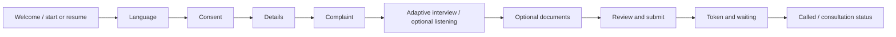

# Patient flow (implemented prototype)

Patient routes are under `/patient` in `apps/web/src/app/patient`; authoritative state is held by the API, not the browser. `PatientFlowProvider` keeps IDs/navigation in local storage and the signed patient token/draft in session storage. A failed API call leaves an error/retry state; the browser does not pretend a submission succeeded.

| Screen               | Input and purpose                                 | Stored result / API interaction                                                                | Failure behavior                                                                     |
| -------------------- | ------------------------------------------------- | ---------------------------------------------------------------------------------------------- | ------------------------------------------------------------------------------------ |
| `/patient`           | Start or resume                                   | `POST /patient-sessions`, `GET /patient-sessions/:id`                                          | Start/resume error and retry/new start                                               |
| `/patient/language`  | English or Hindi                                  | Session language/progress update; unsupported registry languages cannot be selected as active  | Error, keep current step                                                             |
| `/patient/consent`   | Explicit versioned pre-consultation acceptance    | `POST /consents`                                                                               | Cannot advance without successful acceptance                                         |
| `/patient/details`   | Name, age, sex, optional phone                    | `POST /patients` tied to signed session                                                        | Zod validation and retry                                                             |
| `/patient/complaint` | Free-text concern and bounded details             | `PATCH /visits/:id/complaint`                                                                  | Text remains editable; no silent submission                                          |
| `/patient/interview` | Follow-up answers; confirmation/revision          | `/interviews` and answer/confirm/revise/complete routes                                        | Deterministic fallback when optional NLU fails; answer can be retried                |
| `/patient/listening` | Optional browser microphone capture or typed text | `/voice/transcribe`, `/voice/:id/edit`, `/voice/:id/confirm`; accepted transcript feeds intake | Permission/provider error offers text fallback; raw audio not intentionally retained |
| `/patient/documents` | Optional PDF or image                             | Upload, process, status, fact review endpoints                                                 | Optional step can be skipped; errors shown, not mislabelled as extracted facts       |
| `/patient/review`    | Edit details/complaint/answers before sending     | `POST /patient-sessions/:id/submit`                                                            | Remains on review and shows retry if submit fails                                    |
| `/patient/complete`  | Submission receipt and token                      | Displays backend token; links to waiting/timeline                                              | Does not fabricate token; may show pending if state is incomplete                    |
| `/patient/waiting`   | Own token, patients ahead, estimate, call state   | `GET /patient/me/queue-status` every ~8 s while visible                                        | Shows unavailable/retry state and prior result if the API fails                      |
| `/patient/timeline`  | Source-labelled historical record                 | Own authorized timeline API                                                                    | Unavailable/empty states                                                             |

The patient cannot access doctor notes, verification controls, clinic-wide queue data, or another patient's records through authorized API routes. The doctor call updates backend queue state; the waiting page sees it by **polling**, not push. Demo reset clears stale patient state across same-origin tabs and via a reset-generation poll in separate demo browser contexts. See [voice](voice.md), [document AI](document-ai.md), [waiting/token](queue/architecture.md), and [security](security.md).
