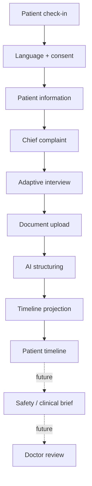

# HELIOS product flow

Language, consent, patient details, adaptive interview, document review, submission, and the patient longitudinal timeline are implemented. Voice capture remains permission-aware and confirmation-first. The timeline organizes source records chronologically without diagnosis or comparison.

Implemented patient-facing stages use explicit consent, editable summaries, synthetic demo content, and distinct patient-reported provenance. Later specifications must still define clinical ownership, retention, escalation, verification, and AI failure behavior. AI-produced information must remain distinguishable from clinician-verified content.

# Adaptive interview

After the chief complaint, the patient sees one server-selected question at a time. Choice, multi-select, duration, severity slider, text, or confirmed Phase 3 voice input can answer it. A normalized preview is confirmed before autosave. Refresh resumes the last confirmed state. When required fields are complete, a pre-final review allows individual answers to be changed before `ClinicalHistory` is produced.
