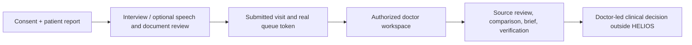

# Product overview

HELIOS turns consented patient waiting time into a structured pre-consultation record. A patient enters details, describes the reason for visiting, optionally records speech or uploads a document, reviews answers, and receives a queue token. The doctor later sees an authorized, provenance-aware summary and controls verification and consultation workflow.

| Need                                     | Prototype response                                                    | Boundary                                                                        |
| ---------------------------------------- | --------------------------------------------------------------------- | ------------------------------------------------------------------------------- |
| Patients repeat fragmented histories     | Longitudinal visits, documents, interview answers and timeline        | Patient must confirm inputs; records can be incomplete or wrong                 |
| Doctors have little time to find changes | Deterministic comparison and short Clinical Brief with evidence links | Not a diagnosis or a substitute for source review                               |
| Waiting is opaque                        | Backend-generated token, queue position and estimate                  | Estimate is a simple operational calculation, not a guaranteed appointment time |
| Data may come from OCR, speech or AI     | Keep source, original value/text and review status distinct           | Model or OCR output is untrusted; doctor verification is separate               |

Target users are patients, clinicians, and a synthetic SIH demo presenter. The patient and doctor route trees are in one Next.js web deployment but use separate screens and API authorization. Neither receives a direct database connection. The API uses signed patient/doctor proofs, role and object-level checks, and a shared PostgreSQL schema.

The clinician remains the final decision-maker. HELIOS does **not** independently diagnose, prescribe, recommend treatment, infer AYUSH–biomedical interactions, or create clinical safety alerts. The planned SafetyEngine is not implemented; risk-related schema and UI unavailable states are not an engine. Production identity, clinical validation, regulatory/legal review, and deployment hardening remain open. See [limitations](limitations.md).

