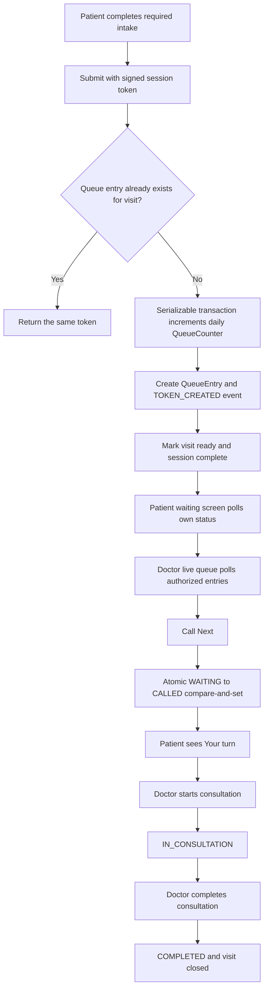

# Phase 14 queue architecture

## Product boundary

The patient and doctor route trees share the HELIOS API and PostgreSQL data, but they do not share authorization or UI payloads. Patient queue endpoints derive identity exclusively from the signed `x-session-token`; doctor endpoints derive identity and role exclusively from the signed `x-doctor-token` and active database user. Request bodies and query parameters cannot select a patient, doctor, or role.

The queue is an operational workflow. It does not diagnose, prescribe, recommend treatment, infer emergency state, or let an LLM decide ordering.

## End-to-end flow



## Persistence

- `QueueCounter` is scoped by `queueKey + queueDate`. Its atomic upsert/increment supplies a sequence number. The model is ready for additional queues without changing the counter algorithm.
- `QueueEntry` references the existing `PatientProfile`, `Visit`, and optional `User` doctor. `visitId` is unique, so retrying submission cannot create a second token for the visit. `queueKey + queueDate + sequence` is also unique.
- `QueueEvent` stores the token, action, actor identity/role, time, and non-clinical metadata.
- The existing `AuditLog` receives every runtime queue mutation. Queue events and audit rows are written in the same database transaction as their state change.
- Position and estimated wait are computed by the backend from current persisted queue state and are not stored or calculated by a browser.

## State machine

```text
WAITING -> CALLED | CANCELLED | NO_SHOW | SKIPPED
CALLED -> WAITING | IN_CONSULTATION | NO_SHOW | SKIPPED
IN_CONSULTATION -> COMPLETED
COMPLETED, CANCELLED, NO_SHOW, SKIPPED -> terminal
CALLED -> CALLED is allowed only as the explicit audited recall action
```

The API exposes named commands instead of accepting an arbitrary status. A compare-and-set update requires the persisted status to still match the expected status.

## Ordering and concurrency

Waiting entries are ordered by:

1. `PRIORITY_REVIEW`, derived only from an already stored, open/acknowledged `HIGH` risk signal that is not the future-demo placeholder.
2. Check-in creation time.
3. Entry ID as a stable final tie-breaker.

This label is an attention cue, not a diagnosis or emergency classification. No LLM participates.

`Call Next` runs in a serializable transaction. It checks queue pause state, reuses an existing active called token for that doctor scope, selects the deterministic first waiting row, and performs `updateMany` with `status = WAITING`. If another caller won the race, no event is written and the service retries against fresh state.

## Position and estimated wait

Only currently waiting entries count toward position. The backend applies the same priority/arrival ordering used by the doctor queue. The initial deterministic estimate is:

```text
patients ahead * 6 minutes
```

The UI labels this value with `~` and states that it is not guaranteed.

## Updates and failure recovery

Both UIs poll every eight seconds only while the document is visible. `QueueNotificationProvider` is the delivery seam; Phase 14 supplies an in-app provider because the database-backed polling response is authoritative. A future WebSocket, SSE, SMS, or push adapter can be attached without changing transitions.

If polling fails, the last confirmed state remains visible and a non-destructive error is shown. Refreshing reloads the same token from the unique visit-linked queue entry.

## UI separation

- `/patient/waiting` shows only the caller's token, current public token, people ahead, estimate, pause state, and workflow status.
- `/doctor` embeds operational actions directly in the dashboard.
- `/doctor/queue` adds All, Waiting, Called, In Consultation, Priority Review, and Completed filters.
- Patient responses contain no names or clinical content from other entries. Doctor queue responses include only authorized assigned patients unless the authenticated role is admin.

## Known deployment boundary

The schema and generated Prisma client validate, and service/API/UI behavior is covered by automated tests. This checkout does not have a configured PostgreSQL server, so migration execution, seed execution, and live two-connection transactional contention remain deployment validation steps rather than claimed runtime results.
