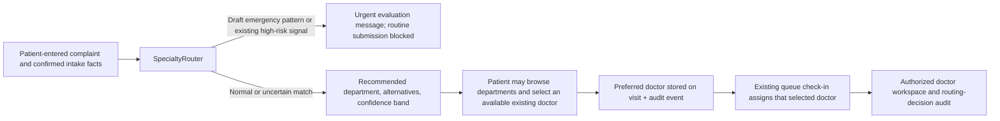

# Specialization routing

## Purpose and boundary

This optional, server-side feature helps a patient begin a non-emergency consultation with a relevant department. It is a deterministic intake-routing aid, **not** a diagnosis, triage clearance, treatment recommendation, appointment guarantee, or replacement for clinician judgement. Its dataset is labelled `CLINICIAN_REVIEW_REQUIRED` and must be approved and maintained by the deploying clinic before clinical reliance.

It is enabled only when `ENABLE_SPECIALIZATION_ROUTING=true`. When disabled, the normal patient submission and queue workflow remain unchanged.



No doctor-only note, uploaded document text, generated summary, diagnosis, or doctor verification is sent into the router. The router uses the current patient complaint and confirmed intake fields; an existing open/acknowledged `HIGH` risk-signal is a conservative escalation input. HELIOS does not currently generate those signals because it has no SafetyEngine.

## Dataset and taxonomy

The versioned source file is [`dataset/routing/specialization-routing.json`](../dataset/routing/specialization-routing.json). It contains the controlled specialty taxonomy, aliases, active mappings, and emergency-pattern drafts. The currently seeded version contains 36 specializations, 34 mappings, and 12 emergency-rule drafts. These rows are persisted in PostgreSQL, not embedded as a hard-coded router switch:

| PostgreSQL table | Responsibility |
| --- | --- |
| `Specialization` | stable ID, patient-facing label, aliases, source, type, active flag |
| `MedicalConditionSpecialization` | active versioned mapping definition and primary specialization |
| `RoutingDecision` | immutable input hash, sanitized input snapshot, output, version and timestamp |
| `User.specializationId` / `acceptingRouting` | classification and explicit routing availability of an existing doctor |
| `Visit.preferredDoctorId` | patient choice used by the existing queue transaction |

The taxonomy references the [American Board of Medical Specialties directory](https://www.certificationmatters.org/boards/) for recognized specialties and its [Internal Medicine board detail](https://www.certificationmatters.org/abim/) / [Psychiatry and Neurology board detail](https://www.certificationmatters.org/abpn/) for scope examples. Those references do **not** clinically validate HELIOS’s mappings. The mapping and alias rules require local clinician review, version control, regression tests, and re-seeding after every approved change.

## Deterministic decision rules

`apps/api/src/routing/routing-engine.ts` normalizes punctuation/case, applies aliases, token and phrase matching, bounded singular/fuzzy matching, negation handling, explicit multi-signal requirements, deterministic tie-breaking, and confidence bands. It returns a primary department plus ordered alternatives and an explanation of matched patient-reported signals. A low-confidence, vague, unknown, or competing result uses General/Family Medicine as a starting point; it never claims a condition has been ruled in or out.

The emergency-pattern list is evaluated before normal specialization matching. It is deliberately conservative, ignores negated or historical-only wording, and prevents the routine queue submission in this application. Its examples are informed by public patient-safety guidance for [chest pain](https://www.nhs.uk/symptoms/chest-pain/), [stroke FAST symptoms](https://www.nhs.uk/conditions/stroke/symptoms/), [anaphylaxis](https://www.nhs.uk/conditions/anaphylaxis/), and [seizure first aid](https://www.nhs.uk/symptoms/what-to-do-if-someone-has-a-seizure-fit/). A non-match is never reassurance or an emergency assessment. Follow local emergency procedures whenever a person may be in danger.

## Provider matching and access controls

Only actual `ACTIVE` doctor records are listed. A doctor becomes selectable for routing only when an administrator or controlled seed explicitly sets a non-`unclassified` `specializationId` and `acceptingRouting=true`. This feature creates no placeholder doctors and does not promise a booking. The patient can change department and browse available doctors manually; if none is available, they can submit for clinic review.

Selecting a provider verifies the signed patient-session proof, patient ownership, active doctor role, active specialization, and routing availability. It writes `Visit.preferredDoctorId` plus the `ROUTING_PROVIDER_SELECTED` audit event. During check-in, the existing queue transaction uses that preferred doctor and ensures the existing doctor-patient assignment exists. Emergency routing cannot select a doctor or enter the routine queue. The doctor-only routing audit endpoint also requires doctor proof and the usual assignment or administrator authorization.

## API and operations

| Method and path | Role | Meaning |
| --- | --- | --- |
| `POST /api/v1/patient/me/routing` | signed patient session | calculate/reuse a sanitized routing decision |
| `GET /api/v1/patient/me/providers?specialization=` | signed patient session | list actual active doctors for a department |
| `POST /api/v1/patient/me/routing/provider` | signed patient session | set or clear a preferred doctor |
| `GET /api/v1/doctor/visits/:id/routing` | authorized doctor/admin | read routing-decision audit for that visit |

Run the following after migration and whenever an approved dataset revision changes:

```powershell
pnpm db:migrate
pnpm routing:seed
pnpm demo:routing:seed   # synthetic demo database only
```

Use `pnpm demo:reset` to restore the deterministic synthetic demo. It preserves the taxonomy and reseeds routing data before verifying the demo baseline.

## Change-control checklist

1. Obtain clinician review for the proposed mapping, aliases, alternatives, and emergency wording.
2. Update the JSON dataset version and provenance, then add deterministic engine cases for positive, negated, historical, vague, pediatric, and emergency inputs.
3. Run migration/seed in an isolated test database and inspect the active table rows.
4. Run `pnpm typecheck`, `pnpm lint`, `pnpm test`, `pnpm test:db`, and connected browser verification.
5. Publish a release note that states the dataset version and whether it is locally approved. Never market the feature as clinical decision support validation without the required governance and validation.
