# HELIOS — detailed system flow through Phase 12

This document maps the implemented repository as of Phase 12. Solid arrows are implemented runtime flow. Dashed arrows identify optional providers, derived projections, invalidation, or explicitly unimplemented boundaries. The source clinical records remain authoritative; timelines, comparisons, briefs, and verification queues are projections or review layers.

## 1. Whole-system map

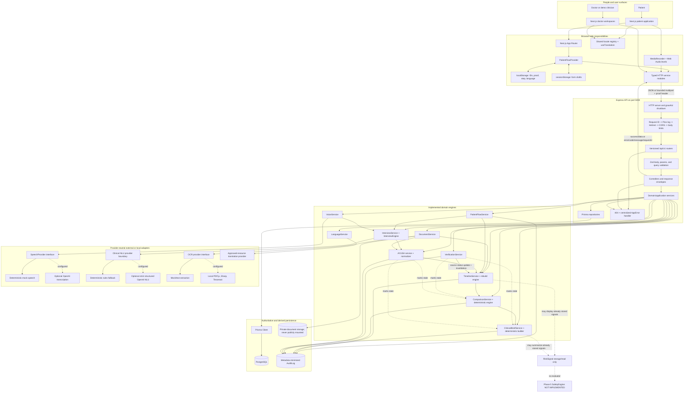

## 2. API boot and request lifecycle

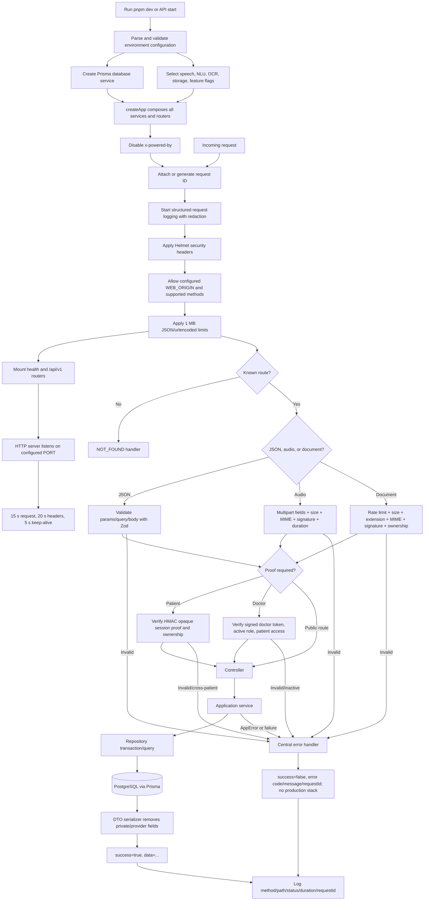

## 3. Complete patient check-in and resume flow

```mermaid
flowchart TD
  Entry[/patient welcome/] --> Choice{Start or resume?}
  Choice -->|Start| NewSession[POST /patient-sessions with default en]
  NewSession --> SessionRow[Create PatientSession STARTED/WELCOME]
  SessionRow --> Proof[Return opaque HMAC sessionToken]
  Proof --> PersistIDs[Store IDs/proof/step/language in localStorage]
  PersistIDs --> Language[/patient/language/]
  Choice -->|Resume| ReadID[Read session ID from localStorage]
  ReadID --> GetSession[GET /patient-sessions/:id]
  GetSession --> Hydrate[Hydrate patient, visit, complaint, drafts, step, language]
  Hydrate --> RouteByStep[Map PatientFlowStep to route]

  Language --> SelectLanguage{Select supported language}
  SelectLanguage -->|English en| SaveLang[PATCH session progress]
  SelectLanguage -->|Hindi hi| SaveLang
  SelectLanguage -->|Coming soon language| Stay[Disabled/unavailable; remain on page]
  SaveLang --> Preserve{Initial selection?}
  Preserve -->|Step LANGUAGE| Consent[/patient/consent/]
  Preserve -->|Mid-flow switch| SameStep[Return to current step without deleting answers]

  Consent --> Explain[Show privacy, purpose, review, and no-diagnosis statements]
  Explain --> Explicit{Checkbox accepted?}
  Explicit -->|No| Block[Continue remains disabled]
  Explicit -->|Yes| SaveConsent[POST /consents; versioned ConsentRecord]
  SaveConsent --> Details[/patient/details/]

  Details --> ValidateDetails[Validate name, age 0-120, sex, optional phone]
  ValidateDetails -->|Invalid| FriendlyErrors[Inline accessible errors; retain draft]
  ValidateDetails -->|Valid| CreatePatient[POST /patients with session ID]
  CreatePatient --> AtomicIntake[Create PatientProfile + PRE_CONSULTATION Visit + bind session]
  AtomicIntake --> Complaint[/patient/complaint/]

  Complaint --> InputChoice{Type or speak?}
  InputChoice -->|Type| ComplaintText[Patient enters own words]
  InputChoice -->|Voice| VoiceFlow[Open /patient/listening voice flow]
  VoiceFlow --> ConfirmedTranscript[Patient edits/confirms transcript]
  ConfirmedTranscript --> ComplaintText
  ComplaintText --> ValidateComplaint[Minimum/maximum validation; preserve original wording]
  ValidateComplaint --> InterviewStart[POST /interviews with session, visit, chief complaint]
  InterviewStart --> Adaptive[/patient/interview/]

  Adaptive --> Question[Server selects exactly one localized question]
  Question --> AnswerMode{Choice, multiselect, duration, severity, text, date, yes/no, voice}
  AnswerMode --> DraftAnswer[Capture raw answer]
  DraftAnswer --> Preview[POST response; interpret but do not confirm]
  Preview --> PatientConfirm{Patient confirms normalized preview?}
  PatientConfirm -->|Edit/retry| DraftAnswer
  PatientConfirm -->|Yes| Confirm[POST interview confirm]
  Confirm --> Autosave[Persist response + confirmed state]
  Autosave --> Missing{Required facts or conflicts remain?}
  Missing -->|Conflict| Clarify[Ask a deterministic clarification question]
  Clarify --> Question
  Missing -->|Missing| Question
  Missing -->|Complete| PreFinal[Interview REVIEW summary]
  PreFinal --> Revise{Revise a field?}
  Revise -->|Yes| Reopen[POST revise; set field NOT_ASKED]
  Reopen --> Question
  Revise -->|No| CompleteInterview[POST complete; materialize ClinicalHistory]
  CompleteInterview --> OptionalDocs{Add previous document?}
  OptionalDocs -->|Yes| Documents[/patient/documents/]
  OptionalDocs -->|Skip| Review[/patient/review/]
  Documents --> Review

  Review --> EditAny{Edit basic info, complaint, health details, documents?}
  EditAny -->|Yes| RouteBack[Return to selected page and resave]
  RouteBack --> Review
  EditAny -->|No| Submit[POST /patient-sessions/:id/submit]
  Submit --> Ready[Session COMPLETED; Visit READY_FOR_DOCTOR]
  Ready --> TimelineProjection[Project visit/source facts to timeline]
  TimelineProjection --> Complete[/patient/complete/ token and next steps]
  Complete --> PatientTimeline[/patient/timeline/]
  Complete --> Reset{Done?}
  Reset -->|Yes| Clear[Clear localStorage/sessionStorage and return home]
```

## 4. Browser state, persistence, and failure recovery

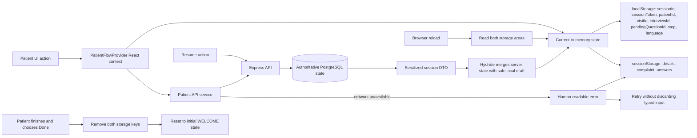

## 5. Adaptive interview and clinical NLU

```mermaid
flowchart TD
  Complaint[Chief complaint in original patient words] --> Classifier{Deterministic pathway classifier}
  Classifier --> Abd[abdominal_pain]
  Classifier --> Chest[chest_discomfort]
  Classifier --> Head[headache]
  Classifier --> Fever[fever]
  Classifier --> Cough[cough_breathing]
  Classifier --> General[general_pain fallback]
  Abd --> InitialFacts[Initialize state and extract bounded duration/vomiting clues]
  Chest --> InitialFacts
  Head --> InitialFacts
  Fever --> InitialFacts
  Cough --> InitialFacts
  General --> InitialFacts

  InitialFacts --> ActiveGraph[Load versioned pathway questions + common AYUSH branch]
  ActiveGraph --> Dependencies[Filter dependency-controlled questions]
  Dependencies --> Conflicts{Existing conflict?}
  Conflicts -->|Yes| ConflictQ[Generate clarify.field yes/no question priority 1000]
  Conflicts -->|No| Required[Find highest-priority uncaptured required field]
  Required --> Localize[Localize question text and visible options to en/hi]
  Localize --> StableValues[Keep optionValues language-neutral for submission]
  StableValues --> Browser[Render one question]

  Browser --> Raw[Submit rawAnswer, language, source]
  Raw --> Ownership[Verify interview belongs to signed patient session]
  Ownership --> Detect[Detect English/Hindi/mixed language metadata]
  Detect --> Provider{Configured ClinicalNLU provider}
  Provider -->|rules/default| Deterministic[Deterministic normalization]
  Provider -. optional .-> OpenAI[Strict schema OpenAI interpretation; storage disabled]
  OpenAI --> Validate[Validate structured output with Zod]
  Validate -->|Invalid| Retry[One constrained retry]
  Retry -->|Still invalid| Deterministic
  Deterministic --> Result[NormalizedAnswer: field/value/state/confidence/source/ambiguity]
  Validate -->|Valid| Result
  Result --> Existing{Contradicts an existing captured value?}
  Existing -->|Yes| Conflict[State CONFLICT; do not overwrite silently]
  Existing -->|No| Preview[Return normalized preview]
  Conflict --> Preview
  Preview --> Confirm{Patient confirms?}
  Confirm -->|No/edit| Raw
  Confirm -->|Yes| Persist[Confirm response and atomically update Interview state]
  Persist --> States[Knowledge states: YES, NO, UNKNOWN, NOT_ASKED, NOT_APPLICABLE, CONFLICT]
  States --> Complete{All active required fields captured and no conflict?}
  Complete -->|No| ActiveGraph
  Complete -->|Yes| Review[Pre-final review/revision]
  Review --> Materialize[Create/update ClinicalHistory; mark interview COMPLETED]
  Materialize --> Audit[Operational AI metadata may be stored; transcripts excluded from generic logs]
```

## 6. Voice recording and transcription state machine

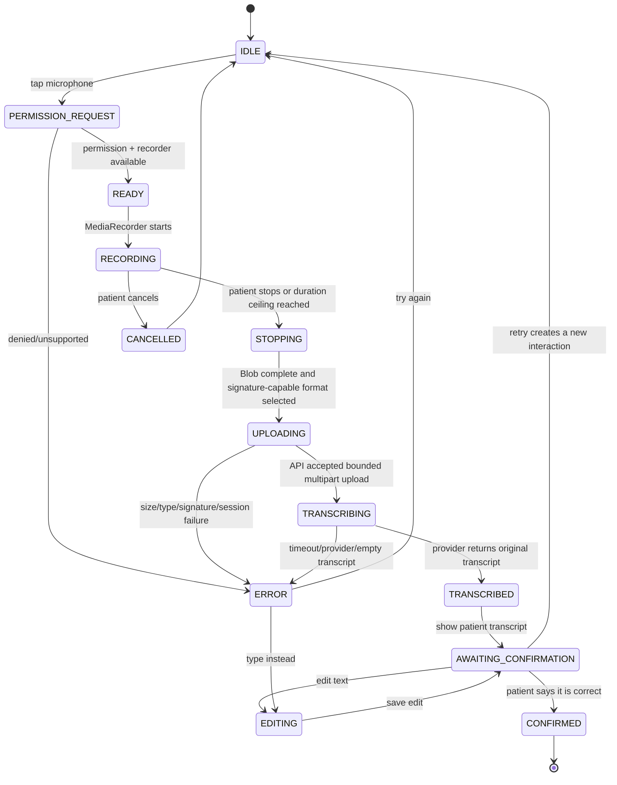

```mermaid
flowchart TD
  BrowserAudio[MediaRecorder audio Blob + declared language + session proof] --> UploadGuard[Server multipart guard]
  UploadGuard --> Size[Enforce VOICE_MAX_FILE_BYTES]
  Size --> Mime[Allowlisted MIME/extension]
  Mime --> Signature[Inspect bytes; ignore unsafe client filename]
  Signature --> Session[Verify proof and resolve session/visit server-side]
  Session --> Provider[SpeechProvider.transcribe]
  Provider --> Mock[Mock provider for deterministic local/test use]
  Provider -. optional .-> OpenAI[OpenAI speech adapter with timeout]
  Mock --> SpeechResult[originalTranscript + detected language(s) + confidence + optional normalized text]
  OpenAI --> SpeechResult
  SpeechResult --> Persist[Create VoiceInteraction; retained=false]
  Persist --> Destroy[Raw audio buffer is not persisted by HELIOS]
  Persist --> PatientReview[Return safe DTO for edit/confirm]
  PatientReview --> Edit[Persist patientEditedTranscript separately]
  PatientReview --> Confirm[Persist acceptedTranscript separately]
  Confirm --> InterviewOrComplaint[Use only patient-confirmed transcript downstream]
  Persist --> Log[Log operation/provider/status/latency/error code only]
```

## 7. Multilingual language layer

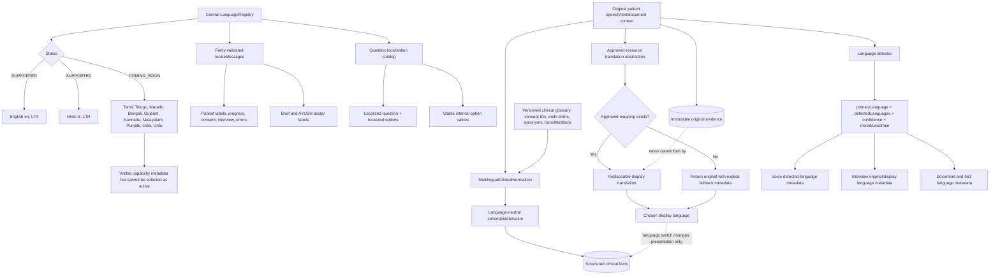

## 8. Medical document upload, OCR, extraction, review, and projection

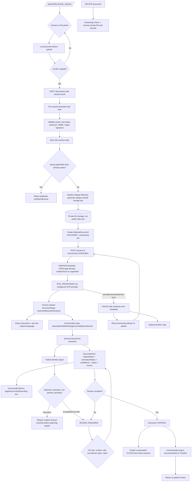

## 9. Longitudinal timeline projection and query

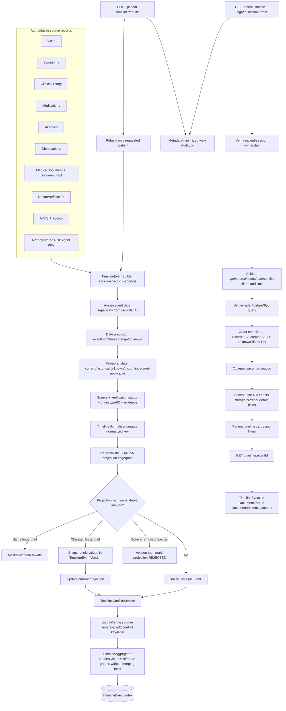

## 10. Deterministic “What Changed?” comparison

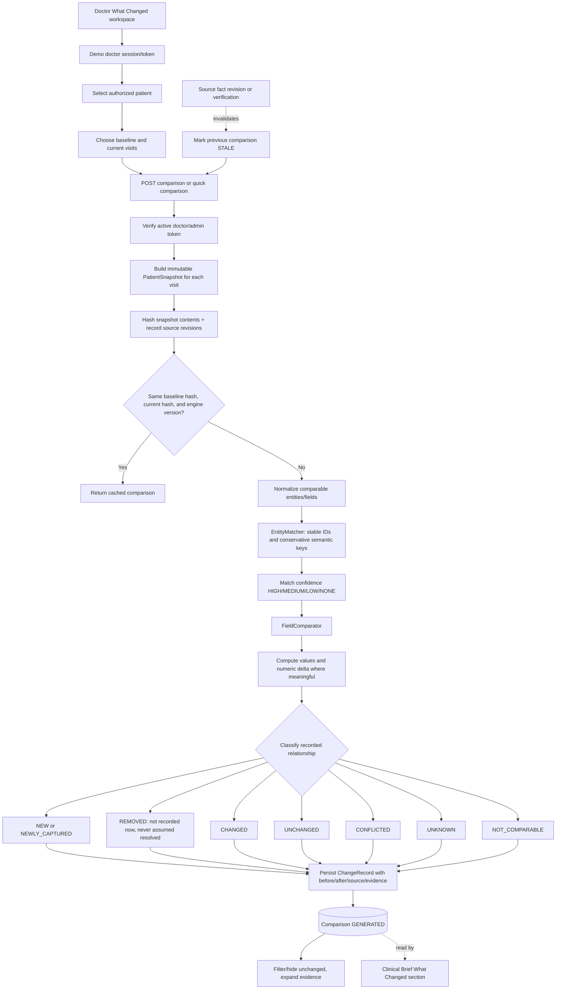

## 11. Clinical Brief generation and evidence

```mermaid
flowchart TD
  Request[Doctor requests quick or persisted brief] --> Auth[Verify signed active doctor]
  Auth --> Repo[ClinicalBriefRepository loads bounded source bundle]
  Repo --> Current[Current visit and patient snapshot]
  Repo --> Symptoms[Current symptoms/history]
  Repo --> Meds[Medications and allergies]
  Repo --> Obs[Recent observations]
  Repo --> Docs[Recent documents]
  Repo --> Comparison[Latest non-stale comparison]
  Repo --> Risk[Already-stored risk signals]
  Repo --> Ayush[AYUSH use]
  Current --> Builder[Deterministic ClinicalBriefBuilder]
  Symptoms --> Builder
  Meds --> Builder
  Obs --> Builder
  Docs --> Builder
  Comparison --> Builder
  Risk --> Builder
  Ayush --> Builder
  Builder --> Bound[Apply BRIEF_MAX limits and recent-month window]
  Bound --> Relevance[Deterministic relevance, deduplication, source priority for display]
  Relevance --> Sections[Structured sections]
  Sections --> Snapshot[PATIENT_SNAPSHOT]
  Sections --> Reason[TODAYS_REASON]
  Sections --> CurrentSymptoms[CURRENT_SYMPTOMS]
  Sections --> Changes[WHAT_CHANGED]
  Sections --> History[RELEVANT_HISTORY]
  Sections --> Medication[MEDICATIONS + ALLERGIES]
  Sections --> Investigations[INVESTIGATIONS + SUPPORTING_DOCUMENTS]
  Sections --> Safety[SAFETY_ATTENTION from stored inputs only]
  Sections --> Verification[NEEDS_VERIFICATION]
  Sections --> Evidence[SOURCE_EVIDENCE]
  Sections --> AyushSection[AYUSH_USE]
  Sections --> Claims[BriefClaim rows with source IDs, provenance, confidence, evidence]
  Claims --> Narrative[Template narrative renderer]
  Narrative --> Unavailable{Dependency failed or absent?}
  Unavailable -->|Failure| Explicit[Mark section UNAVAILABLE, never reassuring absence]
  Unavailable -->|Available| Persist[Persist versioned ClinicalBrief GENERATED]
  Explicit --> Persist
  Persist --> UI[30-second doctor brief view]
  UI --> Drill[Open claim/evidence/document source]
  UI --> Review[Mark REVIEWED or ARCHIVED]
  SourceMutation[Verification, AYUSH, source revision] -. invalidates .-> Stale[Mark brief STALE]
  Stale --> Refresh[POST refresh creates/reuses current version]
```

## 12. Doctor verification transaction

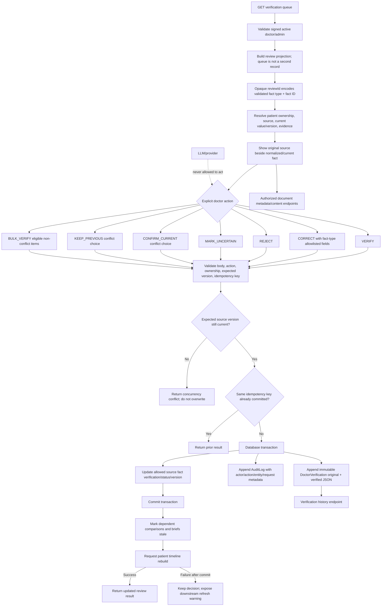

## 13. AYUSH capture and integration

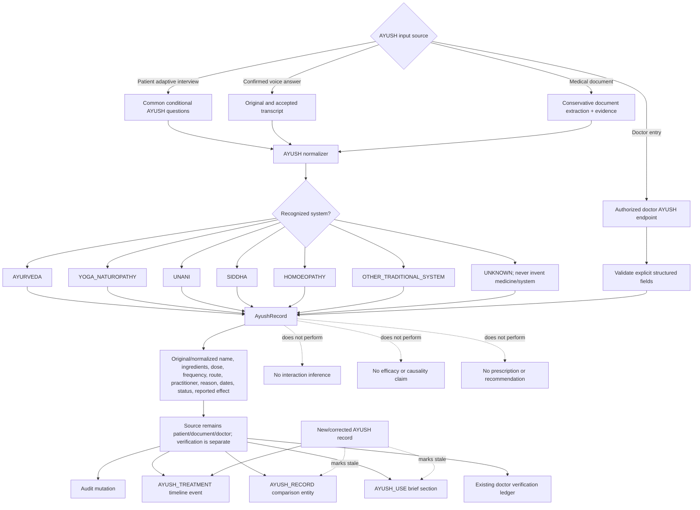

## 14. Persistence map: source records, projections, and ledgers

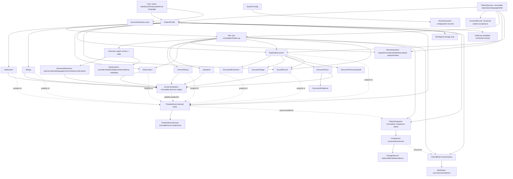

## 15. Security, privacy, provenance, and observability

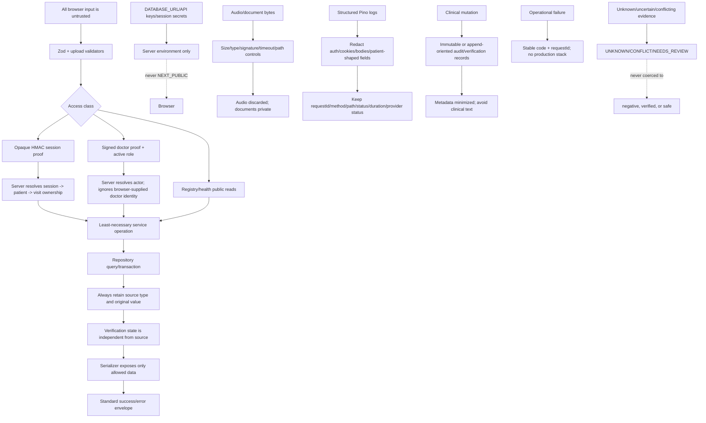

## 16. Synthetic data and reference-intelligence pipeline

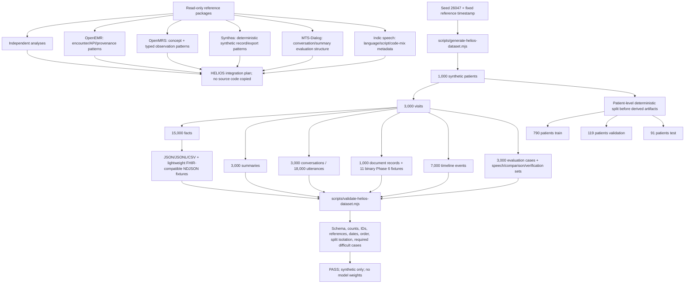

## 17. Developer quality and delivery flow

```mermaid
flowchart LR
  Clone[Workspace checkout] --> Install[pnpm install]
  Install --> Env[Copy .env.example to .env]
  Env --> DB[(Start PostgreSQL 15+)]
  DB --> Generate[pnpm db:generate]
  Generate --> Migrate[pnpm db:migrate]
  Migrate --> Seed[pnpm db:seed: synthetic demo data]
  Seed --> Dev[pnpm dev: web 3000 + API 5000]

  Change[Code/schema/resource change] --> Format[pnpm format / format:check]
  Format --> Lint[pnpm lint]
  Lint --> Types[pnpm typecheck]
  Types --> Locale[pnpm locales:validate]
  Locale --> PrismaValidate[pnpm db:validate]
  PrismaValidate --> Fixtures[pnpm document-fixtures:generate]
  Fixtures --> Tests[pnpm test]
  Tests --> APIResult[API: 208 passed; 5 DB-gated skipped at Phase 12 verification]
  Tests --> WebResult[Web: 26 passed]
  APIResult --> Build[pnpm build]
  WebResult --> Build
  Build --> SharedBuild[Compile @helios/shared]
  SharedBuild --> APIBuild[Compile Express API]
  APIBuild --> WebBuild[Next.js optimized production build, 18 routes]
  WebBuild --> Done[Phase completion report + explicit limitations]
```

## 18. Phase evolution and current boundary

```mermaid
flowchart LR
  P0[Phase 0: workspace, config, health, logging, security foundation] --> P12[Phases 1-2: schema, repositories, patient journey]
  P12 --> P3[Phase 3: voice capture, transcription, patient confirmation]
  P3 --> P4[Phase 4: deterministic adaptive interview + bounded NLU]
  P4 --> Ref[Reference intelligence + synthetic dataset engineering]
  Ref --> Gap[Phase 5 SafetyEngine: not implemented]
  Ref --> P6[Phase 6: Document AI]
  P6 --> P7[Phase 7: longitudinal timeline]
  P7 --> P8[Phase 8: What Changed]
  P8 --> P9[Phase 9: Clinical Brief]
  P9 --> P10[Phase 10: doctor verification]
  P10 --> P11[Phase 11: AYUSH integration]
  P11 --> P12M[Phase 12: multilingual language layer]
  P12M --> Current[Current repository]
  Gap -. explicit unresolved dependency .-> Current
  Current -. not started .-> P13[Phase 13+]
```

## 19. What the system deliberately does not do

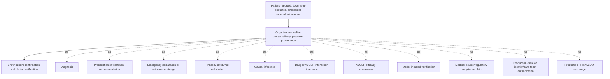
